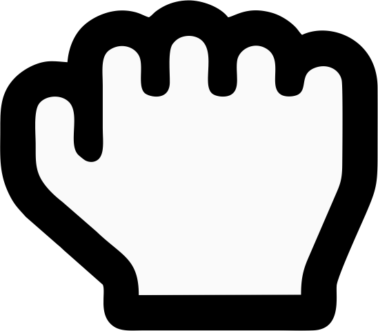
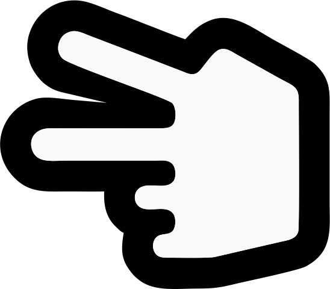
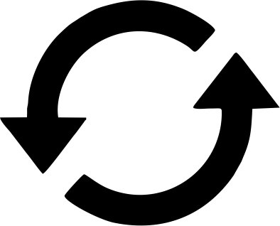

<!DOCTYPE html>
<html lang="en">
<head>
    <meta charset="UTF-8">
    <meta name="viewport" content="width=device-width, initial-scale=1.0">
    <link rel="stylesheet" href="style.css">
    <title>Rock Paper Scissors</title>   
</head>
<body>
    <header>
        
    </header>
    <main>
        <h2>Computer Selection</h2>
        

        

            

        

        
        <h2>Player Selection</h2>
        

            <button onclick="rockFunc()" id="rock">
                
            </button>
  
            <button onclick="paperFunc()" id="paper">
                
            </button>
            
            <button onclick="scissorsFunc()" id="scissors">
                
            </button>
        
  
        

            <button onclick="location.reload()" id="reset">
                
            </button>
        
  
    </main>
    <footer>
        

            

                
Your score

                
0

            

            

                
Computer Score

                
0

            

        

    </footer>
    
</body>
</html>
